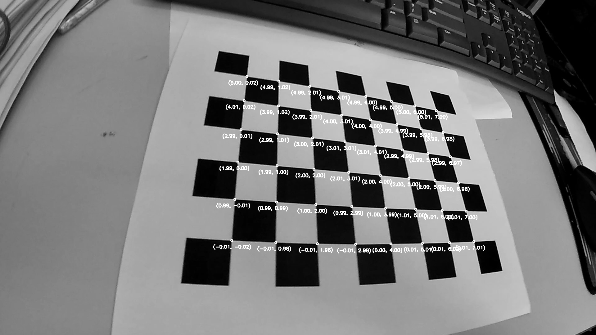

# Calibration
一键标定内外参代码，含测距部分。
## Quick Start
确保已经安装好opencv(>=3.4.2) 以及numpy(>=1.19.2)
```
git clone https://github.com/chakloong883/calibration.git
cd calibration
python calibration.py
```
内外参输出到param.yaml，测距验证图像输出到validate.png，每次重新标定内参需要手动删除param.yaml。
